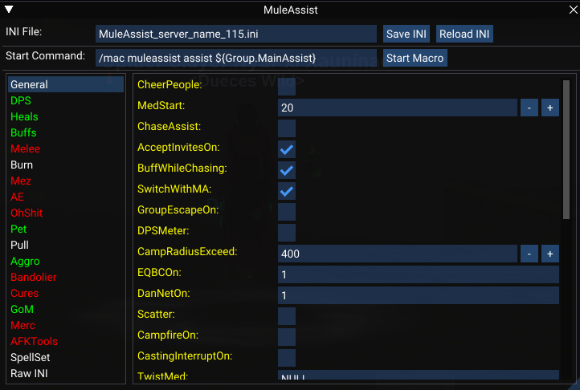
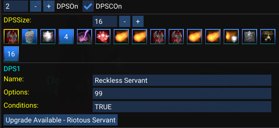
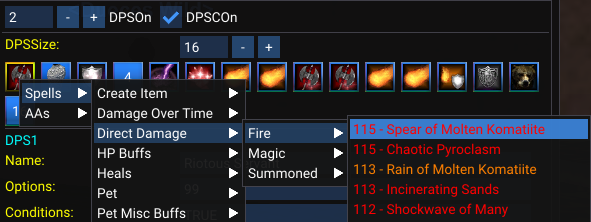

# maui

UI for MuleAssist macro written in Lua using Imgui.

## Installation

Create a folder in the MQ `lua` folder, such as `ma`, and add the contents of this repo to the folder.

## Usage

Start the UI with `/lua run ma\start`, or replace `ma` with whatever you named the new folder in your MQ `lua` folder.

## Examples
bufftab.png  dpstab.png  general.png  rawINItab.png  selecteditem.png  spellpicker.png  spellupgrade.png

Navigate between INI sections from the left menu. Sections which can be enabled or disabled in the INI will be either green or red to indicate whether they are enabled or disabled.

The INI file content can be edited directly by selecting `Raw INI` from the left menu. Note the separate save buttons when editing the raw INI.

Spells which have upgraded versions available in the spellbook will have an upgrade button when they are selected.

Right clicking a button will open a context menu to select a spell, AA or disc.

