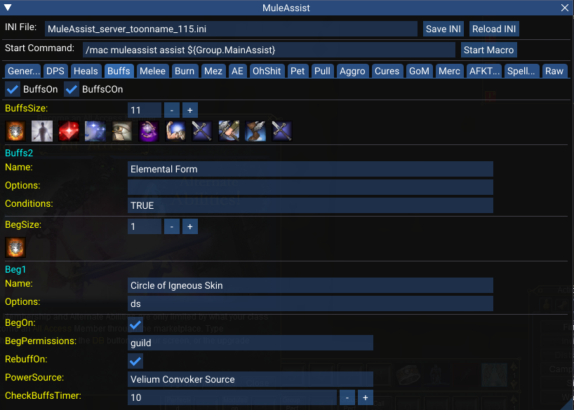
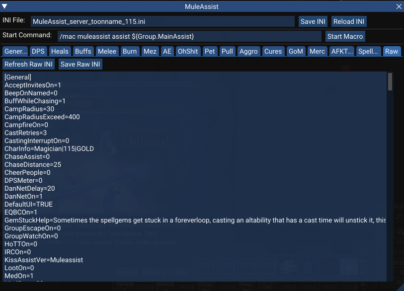

# maui

UI for MuleAssist macro written in Lua using Imgui.

## Installation

Create a folder in the MQ `lua` folder, such as `ma`, and add the contents of this repo to the folder.

## Usage

Start the UI with `/lua run ma\start`, or replace `ma` with whatever you named the new folder in your MQ `lua` folder.

## Examples

